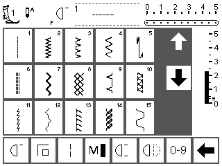

# Finding the Display Image in a Memory Dump

This document explains how the sewing machine's on-screen display (LCD
framebuffer) was located inside a full 16 MB memory dump, and the exact format
needed to render it back into a viewable image.



*The recovered screen: the stitch-selection menu that was showing on the machine
when the dump was taken (rendered 320×240, 4-gray, colors inverted).*

## Result at a glance

| Property        | Value                                                        |
| --------------- | ----------------------------------------------------------- |
| Source file     | `server/MemoryDump-SewingMachine-2026-08-16_13-07-11.bin` (16 MB) |
| **Address**     | **`0x40000`** (offset in the dump)                          |
| **Resolution**  | **320 × 240 pixels**                                        |
| **Color depth** | **2 bits/pixel — 4 gray levels**                            |
| Pixel packing   | Row-major scanlines, MSB-first within each byte             |
| Frame size      | 19,200 bytes (`0x4B00`)                                      |
| Contents        | The live stitch-selection screen                            |

A second, cached copy of a menu screen also exists near `~0x20000`. The whole
low-entropy region `0x20000`–`0x47000` holds several rendered screen bitmaps.

## Bit combinations and their colors

Each pixel is 2 bits, packed MSB-first (the high bits of a byte are the
left-most pixel). The four possible bit patterns map to four evenly-spaced gray
levels via `gray = round(value / 3 × 255)`. The `--invert` flag then flips each
value to `255 − gray` so the render matches the physical LCD.

| Bits (binary) | Value | Raw gray (as stored) | Inverted gray (`--invert`) |
| ------------- | ----- | -------------------- | -------------------------- |
| `00`          | 0     | 0 — black            | 255 — white                |
| `01`          | 1     | 85 — dark gray       | 170 — light gray           |
| `10`          | 2     | 170 — light gray     | 85 — dark gray             |
| `11`          | 3     | 255 — white          | 0 — black                  |

The raw framebuffer stores the background as `00` (dark) and the lit content as
`11` (light); inverting produces the natural dark-text-on-light-background look
shown at the top of this document.

## The tool

A small, dependency-free Node.js helper was written at
[`server/tools/fbfind.js`](../server/tools/fbfind.js). It uses only Node's
built-in `zlib` to emit grayscale PNGs. It has three modes:

- `scan` — an entropy sweep that flags "image-like" regions of the dump.
- `overview` — renders the whole dump as byte-per-pixel PNG pages.
- `render` — expands raw bytes into a grayscale PNG at a chosen bit depth,
  width, and height (with optional `--invert` and packing options).

## Step-by-step

### 1. Scan for image-like regions

Framebuffers stand out statistically: they are neither all-zero nor all-`0xFF`,
and a mostly-blank screen with sparse content has low entropy. The scan flagged
several candidates, including a large, very low-entropy block:

```bash
cd server
node tools/fbfind.js --in MemoryDump-SewingMachine-2026-08-16_13-07-11.bin --cmd scan --block 4096
# ... 0x020000..0x047000  size 324KB  avgEnt 0.54   <- strong candidate
```

### 2. Render candidate regions

Rendering the candidate region as 1-bit pixels made recognizable UI icons and
digits appear, confirming a display bitmap lived here. Narrowing in on the live
frame put it at offset `0x40000`.

### 3. Nail down the exact format

The frame is exactly **19,200 bytes**, which matches several interpretations:

- 320 × 480 @ 1bpp
- 640 × 240 @ 1bpp
- **320 × 240 @ 2bpp**

Rendering as 1bpp produced a readable but flat, oddly-proportioned image (each
2-bit pixel was being split into two 1-bit pixels). Rendering at **320 × 240
with 2 bits per pixel** produced a correctly proportioned screen *with real
gray shading* — the shaded buttons, highlighted cells, and side panels only
appear at 2bpp. That is the machine's native format.

```bash
node tools/fbfind.js --in MemoryDump-SewingMachine-2026-08-16_13-07-11.bin \
  --cmd render --offset 0x40000 --bpp 2 --width 320 --height 240 \
  --out display_320x240_2bpp.png
```

### 4. Invert for a natural look

The raw framebuffer stores the background dark and the content light. Adding
`--invert` swaps black and white so it looks like the physical LCD (dark text on
a light background):

```bash
node tools/fbfind.js --in MemoryDump-SewingMachine-2026-08-16_13-07-11.bin \
  --cmd render --offset 0x40000 --bpp 2 --width 320 --height 240 --invert \
  --out display_320x240_2bpp_inverted.png
```

That inverted render is the image shown at the top of this document.

## Reproduce it

```bash
cd server
node tools/fbfind.js --in <dump.bin> \
  --cmd render --offset 0x40000 --bpp 2 --width 320 --height 240 --invert \
  --out screen.png
```

## Related

- [MemoryDump.md](MemoryDump.md) — the in-app Memory Dump feature.
- [DumpMemory.md](DumpMemory.md) — the command-line dump tool.
