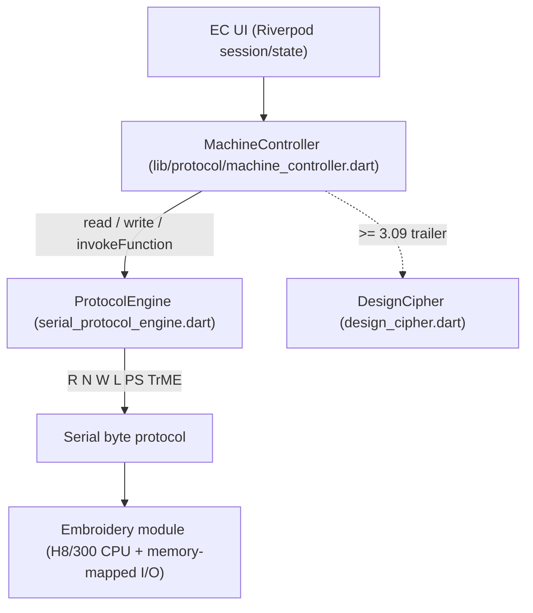

# High-Level Protocol

How Embroidery Communicator talks to a Bernina *artista* 165/170/180/185 over
the serial link once the low-level byte protocol is in place: entering an
embroidery session, listing designs, fetching previews, downloading, uploading
and deleting — plus the firmware-version rules and data formats that govern all
of it.

This is a synthesis of everything currently known. It supersedes the raw capture
log preserved in [HighLevel-old.md](HighLevel-old.md). The byte-level command
layer (`R`/`N`/`W`/`L`/`PS`/`TrME` …) is documented in
[SerialProtocol.md](SerialProtocol.md); the internal boot-loader command set in
[SerialProtocol-old.md](SerialProtocol-old.md).

---

## 1. Layering



- **`ProtocolEngine`** speaks the byte protocol: `read(addr)` (32-byte `R`),
  `largeRead(addr)` (`N`), `readMemoryBlockChecked` / `writeMemoryBlock`
  (`PS`-paged transfers with `L` checksums), and `write(addr, bytes)`. It also
  owns the connection lifecycle (`RF?` auto-baud, `TrME`/`YQ` session, baud
  switch).
- **`MachineController`** implements the high-level operations in this document
  by driving the machine's **function-call interface** (below) and reading/
  writing fixed memory-mapped regions.
- Everything runs **inside a transparent embroidery session** (`TrME`), which
  bridges the PC port through to the embroidery module's processor.

The machine is a memory-mapped H8/300 system: the "protocol" is really *reading
and writing the module's RAM/registers* at well-known addresses, plus poking a
command register to run firmware routines.

---

## 2. Firmware versions and device families

"Version 1 to 4" is not one switch — it is three independent axes. Only the
serial *artista-1xx* family (first row below) is handled here; the others use
different transports/backends and are out of scope for EC.

| Family | Transport | Design format |
| --- | --- | --- |
| **artista 165 / 170 / 180 / 185** | serial Reader/Writer box (**this doc**) | `.BE` — binary, encrypted |
| artista 200 / 730 (630/640/720, 830) | ActiveSync / USB / PDC | `.A20` — ASCII, not encrypted |
| deco 330 / 240, bernette 330 / 340 | "DECO environment" | memory card |
| aurora | "EC on PC" external program | — |

Within the serial family, the **embroidery-module firmware generation** is read
from the `NMMV0x.xx` banner (see [§4](#4-session-lifecycle)) and parsed to a
BCD-hex code (`NMMV03.01` → `0x0301`). Two thresholds change behaviour:

| Gate | Code | What changes |
| --- | --- | --- |
| **`supportsV210`** | `>= 0x0210` | Below it (a **v2** module, `0x0208`) we take the *legacy subset path* — it skips the extra capability/settings probes and has no extra-data-block concept. See [§9](#9-the-v2-legacy-path). |
| **`hasExtraDataBlock`** | `>= 0x0309` | At/above it each design carries an encrypted **extra-data trailer** (colour/settings); below it there is none. |

The **command grammar is otherwise identical across v2/v3/v4** — the flows in
this document are unchanged; only the extra-data trailer and a few internal
probes differ. In code these gates are `FirmwareInfo.supportsV210` /
`hasExtraDataBlock` and the controller's cached `moduleVersionCode`.

---

## 3. The machine-function interface (`0xFFFED0`)

Almost every high-level action is performed by **invoking a firmware function**:
write a 16-bit code into the command register at `0xFFFED0`, then poll the
result register (also `0xFFFED0`, read back as 32 bytes) until it reports done.
In EC this is `MachineController.invokeFunction(code)`.

- Function codes are **odd** (the low bit is the "invoke" marker).
- A function completes when the **status word** — `RFFFED0[0..1]`, big-endian —
  reads `0x0002` (OK) or `0x0000` (idle after end-of-session). `0x8005` means
  **memory full**; bit `0x8000` marks an error.

### Argument registers (write *before* invoking)

| Register | EC name | Purpose |
| --- | --- | --- |
| `0x0201DC` | `setArgument1` | file number / index (usually `index + 1`) |
| `0x0201E1` | `setArgument2` | page number / flag |

### Function codes

| Code | Name | Args | Purpose |
| --- | --- | --- | --- |
| `0x00A1` | Select module memory | — | route access to **built-in** memory (marker `0x63` at `RFFFED0[11]`) |
| `0x0051` | Select PC Card | — | route access to the **Personal Design Card** (marker `0x33`) |
| `0x0031` | Move to page 1 | `arg2 = 0` | select first directory page |
| `0x0061` | Move to page 2 | `arg2 = 1` | select second directory page |
| `0x00C1` | Move to page 3 | `arg2 = 2` | select third directory page |
| `0x0021` | Load directory | — | commit page selection / refresh file count |
| `0x0011` | Prepare upload | — | reserve space (returns `0x8005` if full) |
| `0x0201` | Write new file | staged blocks | **commit** an upload (host waits ~4–5 s) |
| `0x0401` | Stage design | `arg1 = index+1` | stage a design into RAM to **download** it |
| `0x0041` | Prepare delete | — | begin a delete |
| `0x0801` | Execute delete | `arg1 = index+1` | **delete** the selected file (host waits ~6 s) |
| `0x0081` | Format / erase all | — | **erase the user design area** — destructive |
| `0x0101` | End session | — | re-enable the module's designs on the machine; clear state |

> **Paging is fixed at three pages of 27 designs.** Index `< 27` → `0x0031`,
> `27–53` → `0x0061`, `>= 54` → `0x00C1`; `arg2 = index / 27`. There is no page 4.

> Always finish with `0x0101`. Skipping it leaves the sewing machine unable to
> see the module's designs until the next session ends properly.

Full details and the 32-byte result-block layout:
[MachineFunctions.md](../../SerialProtocol/MachineFunctions.md).

---

## 4. Session lifecycle

Every high-level operation follows the same envelope:

1. **Enter embroidery mode.** Auto-baud (`RF?`), switch the bridge to the module
   (`TrME`), confirm (`YQ` → `O`). Verify the mode by reading `0x57FF80`
   (`B4 A5` = sewing machine is the active processor → switch needed).
2. **Read the firmware version** from `0x200100` (`N200100`). The `N` read yields
   version, language, manufacturer and date; the leading `NMMV0x.xx` is parsed to
   `moduleVersionCode` and drives the gates in [§2](#2-firmware-versions-and-device-families).
3. **Select the storage source**: invoke `0x00A1` (module memory) or `0x0051`
   (PC Card). For the card, first confirm presence via `0xFFFED9` (`0x83` =
   present, `0x82` = empty).
4. **Do the operation** (list / preview / download / upload / delete).
5. **End the session**: invoke `0x0101`, then leave transparent mode.

---

## 5. Memory map (module RAM / registers)

The fixed addresses every flow uses. These are memory-mapped locations on the
module read/written with `R`/`N`/`W`/`PS`.

| Address | Size | Meaning |
| --- | --- | --- |
| `0x57FF80` | word | active-processor marker (`B4 A5` = sewing machine) |
| `0x200100` | block | firmware identity (`NMMV…`/`SRMV…`, language, mfr, date) |
| `0xFFFED0` | 32 B | **function command / result register** ([§3](#3-the-machine-function-interface-fffed0)) |
| `0xFFFED9` | byte | PC-card slot: `0x83` present / `0x82` empty |
| `0x0201DC` | byte | argument 1 (file index) |
| `0x0201E1` | byte | argument 2 (page / flag) |
| `0x024080` | byte | **file count** (first byte) |
| `0x0240B9` | N | **attribute** byte per file, `0x00`-terminated |
| `0x0240D5` | 32×N | **file names** (32 bytes each, ASCII, NUL-padded) |
| `0x02409D` | byte | block-size byte written on upload (`0x01`; units unclear) |
| `0x02452E` | 0x22E | **preview** base; icon *i* at `0x02452E + 0x22E*i` |
| `0x024480` | 174+558 | preview upload block (header + icon) |
| `0x028F40` | 8 | staged design **lengths**: data len (BE dword) @+0, extra len @+4 |
| `0x028F48` | N | staged design **body** (+ extra trailer) for download |
| `0x028E98` | 176+N | main upload block (header + EXP + extra) |

> **Length-field order.** On both download (`0x028F40`) and upload (`0x028E98`
> header) the **file-data length comes first (`+0`)** and the **extra-data length
> second (`+4`)**. This order is confirmed by the captures; the `SerialProtocol/`
> bernina reference has them swapped and is *not* hardware-validated — do not
> adopt it (see [todo.md](todo.md)).

### Attribute byte (`0x0240B9`)

| Byte | Meaning |
| --- | --- |
| `0xA4` | 1-block, **read-only** design (ROM) |
| `0xAC` | 2-block, read-only **alphabet / font** |
| `0x86` | 1-block **user** design (writable) |
| `0x00` | end-of-list terminator |

Bit `0x20` = read-only ROM, `0x08` = alphabet/font, `0x02` = user/writable.
(Testing `0x04` would misclassify — it is set on every entry.)

---

## 6. Reading flows

### 6.1 List files

Enter the session, select the source, then page through the directory:

1. `0x00A1` / `0x0051` — select source; `0xFFFED9` — card check (card only).
2. `setArgument1(1)`, `setArgument2(0)`, invoke `0x0031` then `0x0021`.
3. Read the **file count** from `0x024080` (first byte).
4. For each page of ≤ 27 files:
   - read attributes from `0x0240B9`,
   - read `filesOnPage × 32` name bytes from `0x0240D5`,
   - advance: page 2 → `0x0061`, page 3 → `0x00C1` (with `arg2 = pageIndex`).
5. Invoke `0x0101`, end the session.

EC: `MachineController.readEmbroideryFiles`. Each 32-byte record yields a name
(NUL-trimmed) and an attribute byte.

### 6.2 Preview icon

The icon is a **72 × 62, 1-bpp** bitmap, **558 bytes** (`0x22E`), 9 bytes/row,
MSB-first. After selecting the source and loading the directory page for the
target file, read `0x22E` bytes from `0x02452E + 0x22E*(fileId % 27)`.

EC: `readEmbroideryFilePreview`; rendered by the preview widgets.

### 6.3 Download a design

1. Select source; load directory (`0x0031`/`0x0061` + `0x0021`).
2. `setArgument1(fileId+1)`, `setArgument2(1)`, invoke `0x0401` — **stage** the
   design into RAM.
3. Read the two length dwords from `0x028F40`: `dataLen` @+0, `extraLen` @+4.
4. Read `dataLen + extraLen` bytes from `0x028F48` (paged `N`/`R`, checksummed).
5. Split: the first `dataLen` bytes are the **EXP body**; the remaining
   `extraLen` bytes are the **extra-data trailer** — but only on a capable
   module (see below).
6. Invoke `0x0101`, end the session.

**Extra-data handling** (EC `readEmbroideryFile`):

- `hasExtraDataBlock` (`>= 3.09`): the trailer is framed + encrypted — decrypt it
  with `DesignCipher` and strip the 8-byte frame header to expose the payload.
- `2.10 – 3.08`: the trailer is attached raw (plaintext).
- **v2 (`< 2.10`)**: there is no extra-data concept — the trailer is **not split
  off** at all (see [§9](#9-the-v2-legacy-path)).

The **EXP body is always plaintext on the wire** — do not decrypt it; the cipher
only ever applies to the `>= 3.09` trailer and to the on-disk `.BE` format.

---

## 7. Upload a design

An upload sends two blocks plus three small fields, then commits. EC:
`writeEmbroideryFile`, `createMainDataBlock`, `createPreviewDataBlock`.

**Main data block** → `0x028E98` (176-byte header):

```
+0x00  word    ~ EXP length / 5   (size hint, big-endian; 0 in EC)
+0x02  166 × 0x00
+0xA8  dword   EXP body length    (body must end with 0x8081)
+0xAC  dword   extra-data length  (0 if none)
+0xB0  ...     EXP body (stitch stream)
       ...     extra-data trailer (framed + encrypted, only if >= 3.09)
```

**Preview block** → `0x024480`: 174-byte header (`00 00 09 3E FF` then zeros;
`0x093E` encodes the 72×62 monochrome type) followed by the 558-byte icon.

Sequence:

1. Enter session; select source (card: confirm presence).
2. Invoke `0x0011` (prepare upload) — `0x8005` ⇒ machine full, abort.
3. Write the main block to `0x028E98` (header at `0x028E98`, body paged from
   `0x028F48`).
4. Write the preview block to `0x024480`.
5. `0x02409D ← 0x01` (block size), `0x0240B9 ← 0xA4` (attribute),
   `0x0240D5 ← name` (32 bytes, padded).
6. Invoke `0x0201` (commit; wait ~5 s).
7. Reselect module memory (`0x00A1`) and re-read the catalogue so the new file
   appears; end with `0x0101`.

Notes:

- EC **appends `0x80 0x81`** to the EXP body if it isn't already terminated
  (`createMainDataBlock`).
- The extra-data trailer is `DesignCipher.frameAndEncrypt`-ed and included
  **only** when `hasExtraDataBlock`; on v2/mid-v3 the extra length field is `0`
  and no trailer is sent.

---

## 8. Delete a file

1. Enter session; select source.
2. Invoke `0x0041` (prepare delete).
3. `setArgument1(fileId+1)`, `setArgument2(1)`.
4. Invoke `0x0801` (execute; wait ~6 s).
5. Reselect (`0x00A1`) and re-read the catalogue — deleting renumbers later
   files; end with `0x0101`.

EC: `deleteEmbroideryFile`.

---

## 9. The v2 legacy path

A **v2** module (`NMMV02.08`, code `0x0208`) fails the `>= 2.10` capability gate.
We take the *legacy subset path* that omits a set of
low-level capability/settings probes (module registers `0x24040`/`0x24004`/
`0x24044`/`0x24048`) and has **no extra-data-block concept**.

At EC's high-level layer the v2 path is simply the *smaller* one — the
list/download/upload/delete grammar is identical. The only concrete difference
EC encodes is in the download split: on a confirmed v2 module
(`_isLegacyV2Module`) the trailing `extraLen` bytes are **never** treated as an
extra-data trailer (a v2 machine has none), so the whole staged block is the
design body. Unknown version (`0`) is treated as capable so a failed version read
never drops data.

The low-level `0x2404x` probes are BEAGLink internals EC never performs, and the
docs confirm the machine-function flows work unchanged on v2 — so nothing else
needs replicating. See [todo.md](todo.md) for the one open question (whether a
real v2 module ever reports a non-zero extra length).

---

## 10. Data formats

- **EXP stitch stream** — flat sequence of signed `(dx, dy)` byte pairs with
  `0x80`-prefixed control codes (jump / colour-change / stop). Ends with the
  `0x8081` **stop code**; EC appends it on upload and treats it as the body
  terminator. Details: [ExpFormat.md](ExpFormat.md) /
  [FileFormats.md §1](../../SerialProtocol/FileFormats.md#1-exp-stitch-format).
- **Extra-data trailer** — a per-design block of "extracted instructions" /
  colour & settings the machine follows. Present only on `>= 3.09` firmware,
  where it is framed (8-byte header, little-endian length @+2) and encrypted.
- **`.BE` on-disk format** — the encrypted binary design file the original
  software saves; the same symmetric cipher (`DesignCipher` /
  `EncryptDecryptBuffer`) used for the `>= 3.09` trailer. Fully specified in
  [DesignEncryption.md](../../SerialProtocol/DesignEncryption.md).
- **Preview bitmap** — 72 × 62, 1-bpp, 558 bytes, 9 bytes/row MSB-first.

The design **cipher is a self-synchronising byte stream keyed only from the
payload length** (no secret key) — an obfuscation layer, fully reversible. See
[design_cipher.dart](../src/lib/protocol/design_cipher.dart).

---

## 11. Where this lives in EC

| Concern | Code |
| --- | --- |
| High-level flows | `lib/protocol/machine_controller.dart` |
| Byte protocol / session | `lib/protocol/serial_protocol_engine.dart` |
| Design cipher | `lib/protocol/design_cipher.dart` |
| Firmware model / gates | `lib/domain/models/firmware_info.dart` |
| Serial transport | `lib/transport/desktop_serial_transport.dart` |

---

## 12. Related documents

- [SerialProtocol.md](SerialProtocol.md) — the byte-level command layer.
- [ExpFormat.md](ExpFormat.md) — the EXP stitch format as EC parses it.
- [SerialCapture.md](SerialCapture.md) — capturing live traffic.
- [todo.md](todo.md) — items to verify against a real machine.
- [HighLevel-old.md](HighLevel-old.md) — the original raw capture log.
- `SerialProtocol/` deep-dives:
  [ReadingData.md](../../SerialProtocol/ReadingData.md),
  [WritingData.md](../../SerialProtocol/WritingData.md),
  [MachineFunctions.md](../../SerialProtocol/MachineFunctions.md),
  [FileFormats.md](../../SerialProtocol/FileFormats.md),
  [DesignEncryption.md](../../SerialProtocol/DesignEncryption.md).
